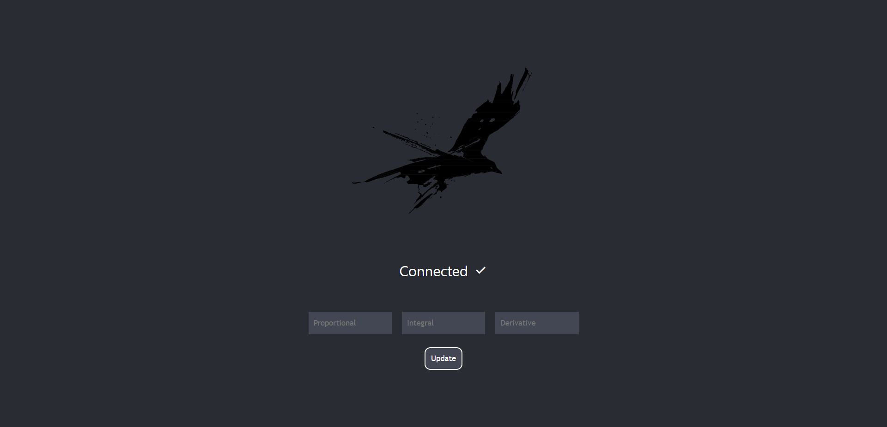

# PID Tuner Dashbaord

A React app that uses network tables to update PID values for a PID Controller in real-time.

## Usage
1. Create an instance of the [PIDTuner class](../robot/src/main/java/frc/robot/subsystems/Dashboards/PIDTuner.java) in the subsystem file that contains your PID Controller.

    `private PIDTuner pidTuner = new PIDTuner();`

2. Use the getter methods in the PIDTuner object to set the values of your PID Controller. This should go in the periodic method of your subsystem so the values are continuously updated.

    ```@Override
    public void periodic() {
        pidController.setPID(pidTuner.getP(), pidTuner.getI(), pidTuner.getD());
    }
    ```

3. Complete the [Dashboard UI Setup Instructions](../dashboard/README.md) to run the PID Tuner Dashboard.

4. The PID values inputted to the dashboard will be sent to the robot over network tables when the update button is clicked.

